其实这个教程只是写给想用终端运行的童鞋，毕竟从终端看的清楚一点。

即使不用这个，在Spyder里面也是可以运行的，只不过看起来是一帧一帧的。

注意一点，os.system("clear")是在Mac里用来清空屏幕的
Windows里面应该改成，os.system("cls")。改好了再运行哦，不然会出错。

## Win版操作 

首先打开文件，比如game_of_life.py, 如下图
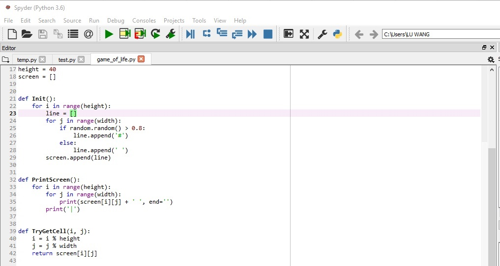

然后选择Run选项里面的Configure 
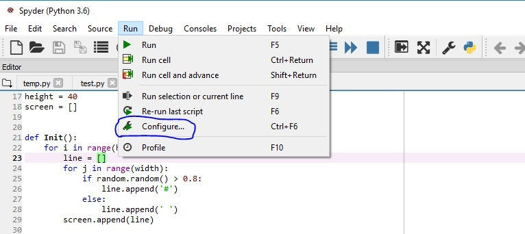

选择Execute in an external System terminal，并且点击OK
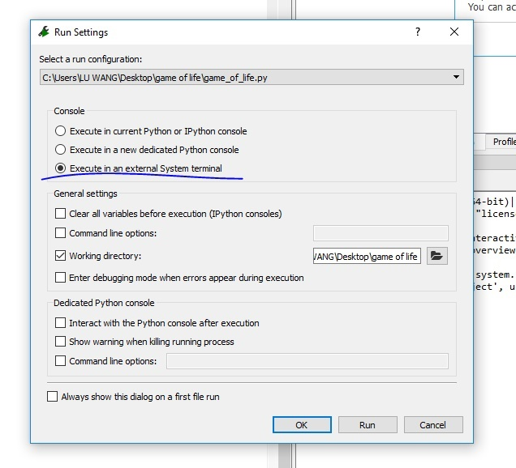

最后运行程序
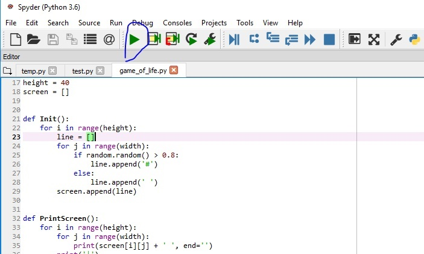

## Mac版操作

很遗憾的是，目前Mac版的Spyder还不支持我们用Win那样方式打开系统终端

但是用如下的方式效果相同。

首先打开系统偏好，如下图
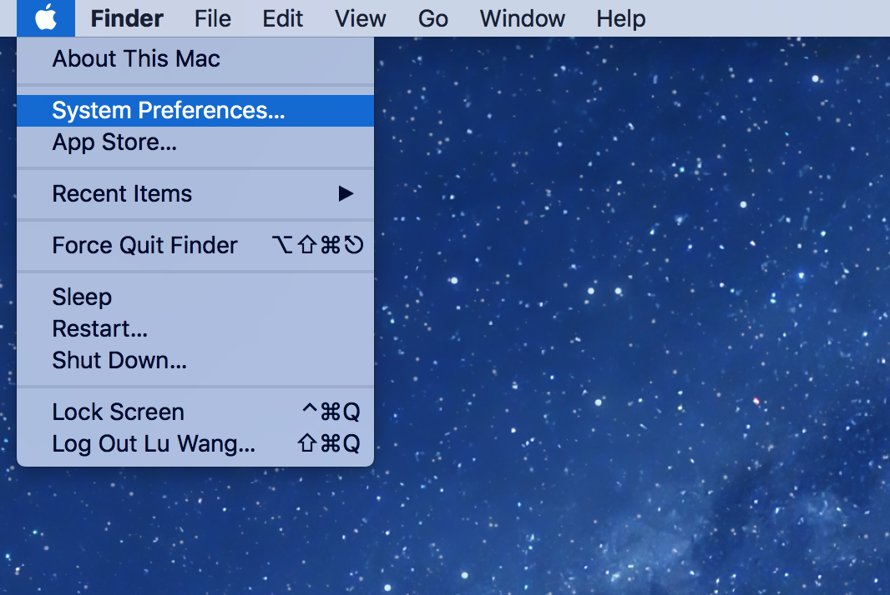
选择键盘Keyboard
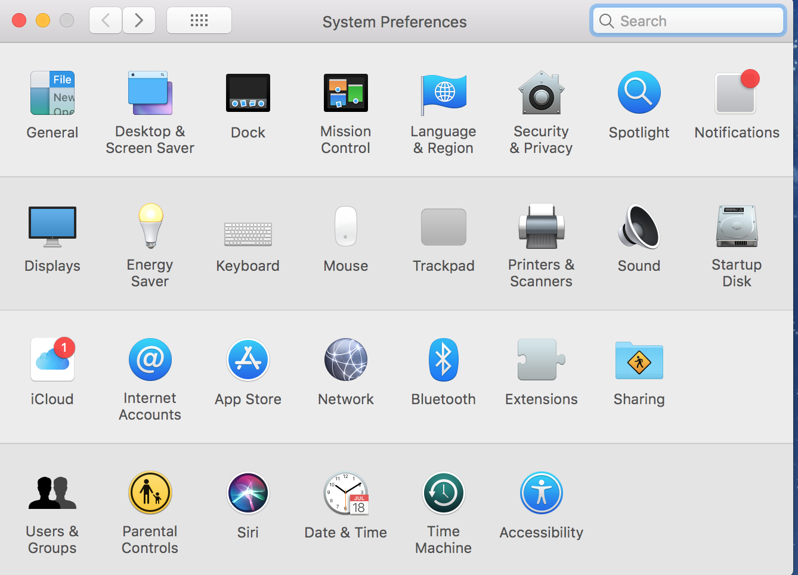
在Services服务，勾上New Terminal at Folder（新建位于文件夹位置的终端窗口）
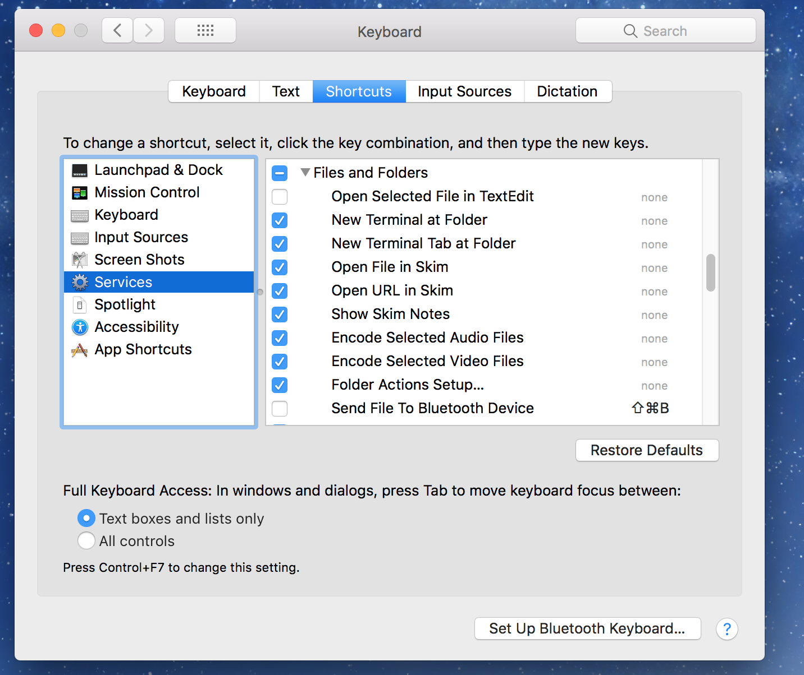
这样你就可以直接从文件夹打开终端。
将你有游戏程序的文件夹放到电脑某个位置，这里我放在桌面。选择它右键，在Services里面选择New Terminal at Folder
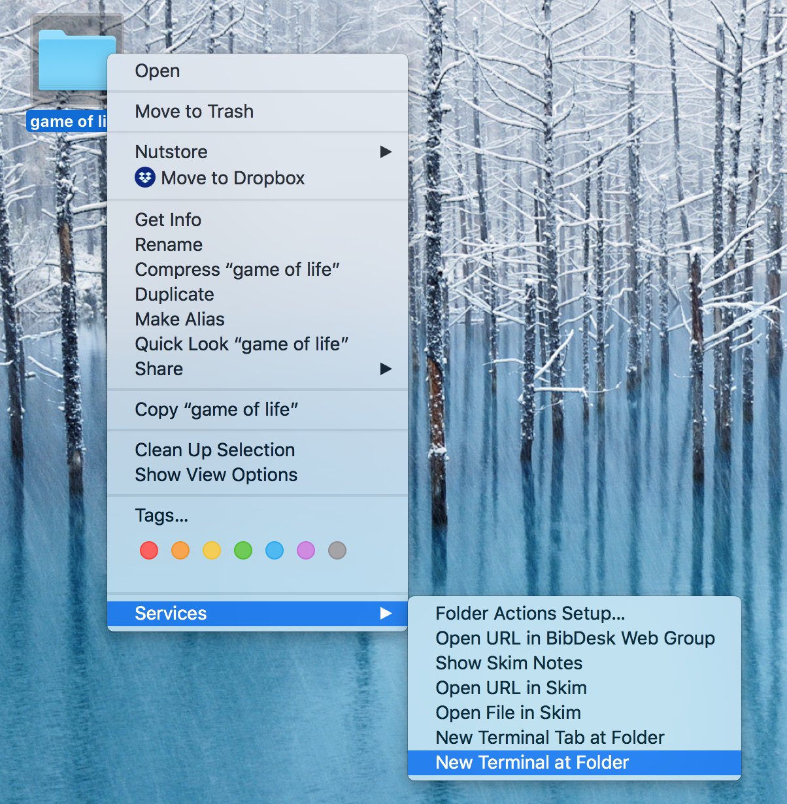
然后就出现终端了，但是我们还没有运行程序
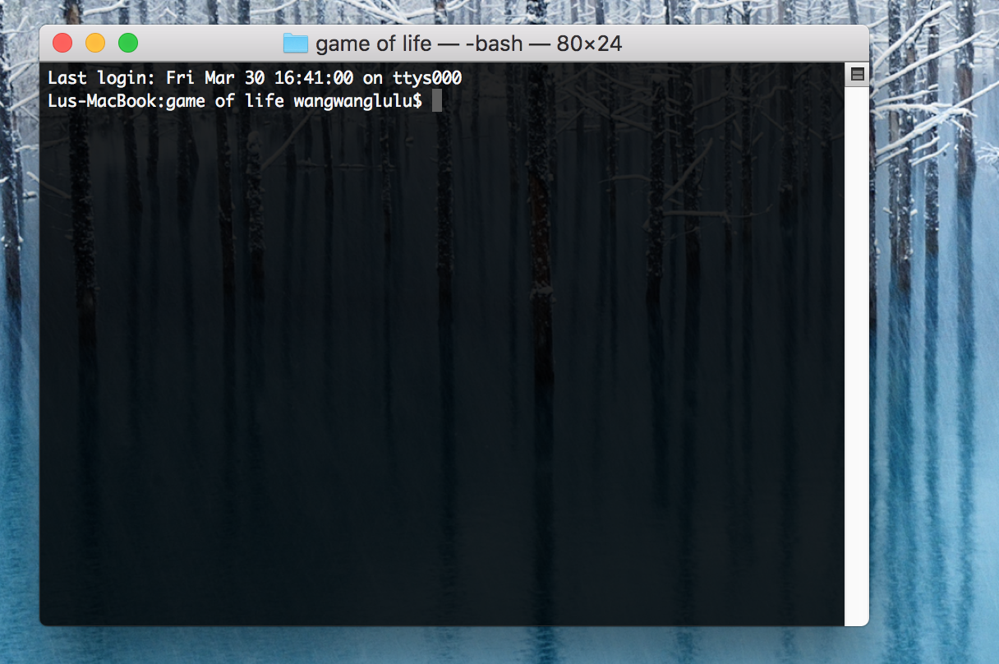
输入命令，python simple.py。当然你想运行什么程序就输入，python xxx.py (xxx是文件名)
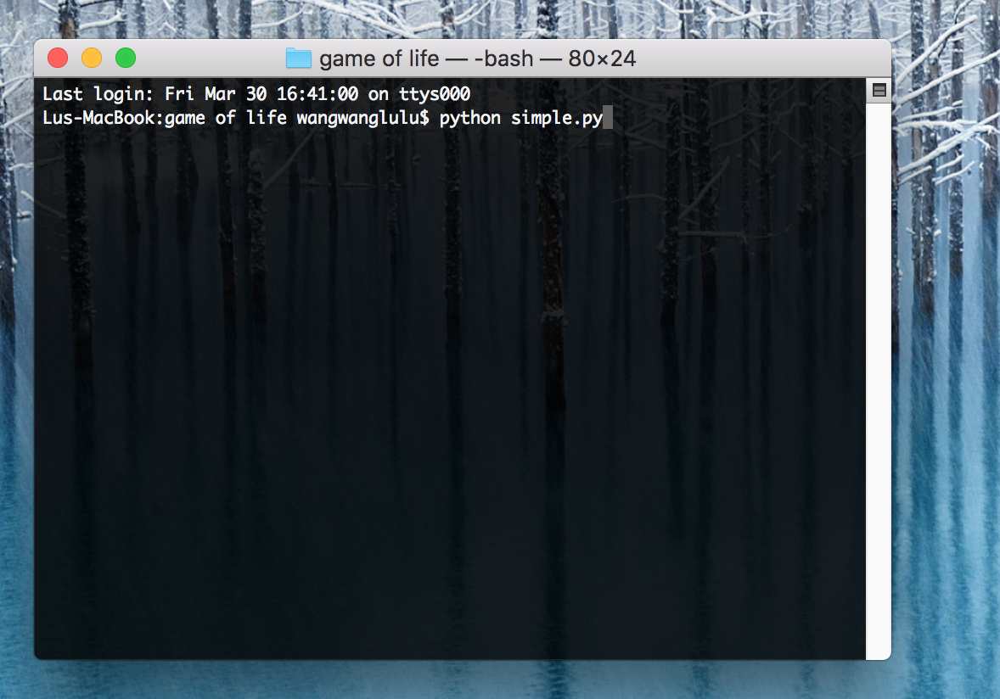
然后就OK了。

你可能发现你的终端是白底黑字，不是我这种黑底白字，这个很简单。

选择终端的偏好
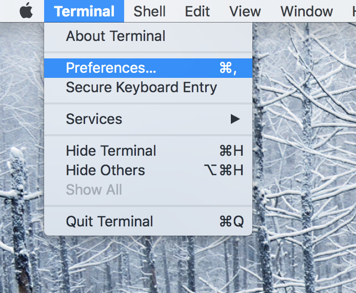

你想设置成什么样就是什么样
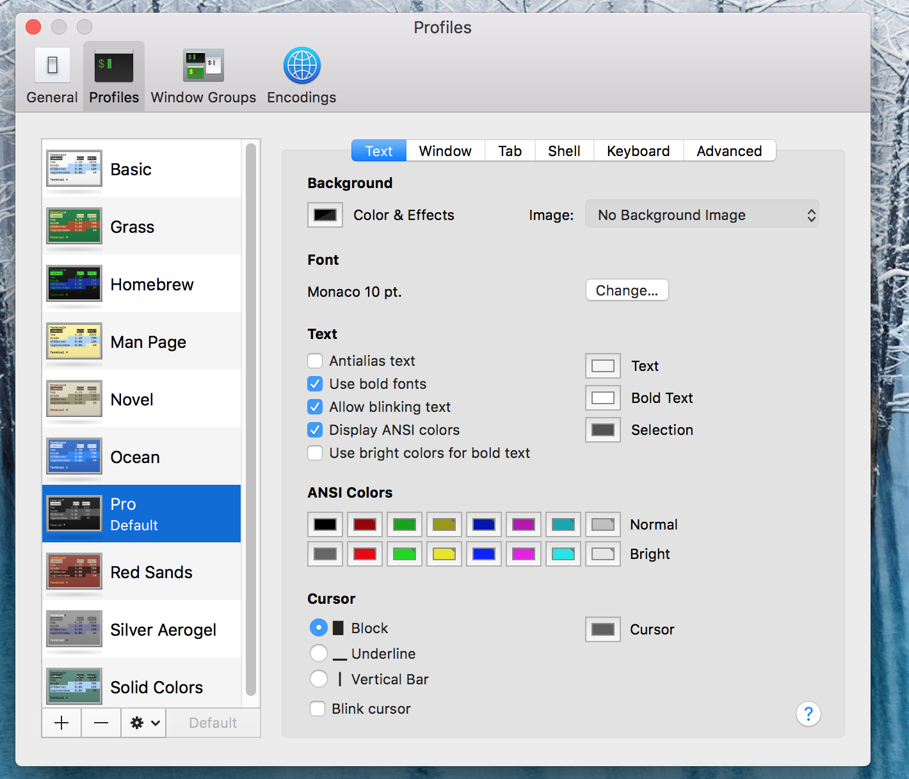

如果你在哪一步卡住了，请先在百度或者谷歌搜搜解决办法，总之就是Mac终端运行Python程序咯。
